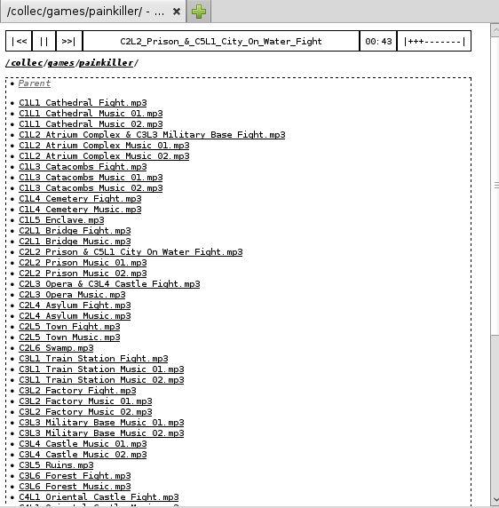

## What is WebP3? (use case)

WebP3 is a humble web-app (server) to play your audio files remotely. Typically, you host WebP3 on your personal home machine (or server) where your music files sit, and you can then play the music remotely at work or on a device in your browser.

No, there aren't any user-data-exploiting/social features and no, it's not hosted on some million-dollars cloud, it's hosted on your machine.

## Design

WebP3 exposes a tree of folders and files that can be browsed through the web interface. A few root directories are specified on the command-line to run WebP3, and all the content under those roots is exposed, as there are no fine-grained permissions.

An HTML5 player allows to play the audio files from a requested dir.

It is designed to serve trees with a folder is an album (or contains other folders). ID3 is not necessary as it's not used.

### Format support

WebP3 doesn't use Flash and solely relies on HTML5's `<audio>` tag. File format support (like mp3) depends on your browser and OS.

## Usage

First, run something like:

`webp3.py -p 8000 music=/path/to/some/files music2=/another/folder/to/share`

The command will not terminate, the files are served as long as WebP3 is running.

Open `http://localhost:8000` to see (and play!) the music. There will be 2 roots, /music and /music2, serving respectively the full content of /path/to/some/files and /another/folder/to/share.

### Options

`-p PORT`

WebP3 will listen on port (default: 8000)

`--zip`

When requested a URL of a directory with "?zip=1" appended, WebP3 will serve a zip archive of all files contained in the directory requested. This operation is not recursive.

The zip file is stored in a temp dir on the server while the archive is transferred and is removed when the download is finished (or encountered an error). In order to limit an attacker requesting a lot of zip files at the same time to saturate the server disk, there can be only 2 zip requests at the same time, other requests return an error immediately.

## License

WebP3 is licensed under the [do What The Fuck you want Public License v2](http://wtfpl.net).
