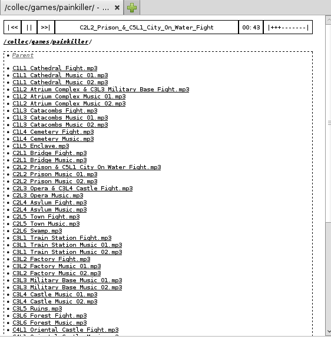

What is WebP3? (use case)
=========================

WebP3 is a humble web-app (server) to play your audio files remotely.

Typically, you host WebP3 on your personal home machine (or server) where your music files sit, and you can then listen to the music remotely at your workplace or on a handheld device in your browser.
It's designed for personal use.

No, there aren't any user-data-exploiting/social features and no, it's not hosted on some million-dollars cloud, it's hosted on your machine or your server.

Design
++++++

WebP3 exposes a tree of folders and files that can be browsed through the web interface.
A few root directories are specified on the command-line to run WebP3, and all the content under those roots is simply exposed on the web interface, as there are no fine-grained permissions.

An HTML5 player allows to play the audio files from a requested dir.

It is designed to serve trees where a folder is an album (or contains other folders). ID3 is not necessary as it's not used.

Audio format support
--------------------

WebP3 doesn't use Flash and solely relies on HTML5's `<audio>` tag. So, audio file format support (like MP3) depends on your viewing browser and OS.

JSON
----

When "application/json" mimetype is present in the "Accept" HTTP header, the listing of the browsed directory is returned in JSON format.

M3U
---

When "audio/x-mpegurl" mimetype is present in the "Accept" HTTP header, or if the URL ends with "?m3u", the listing of files the browsed directory is returned in M3U playlist format.
Thus, the URL can be given to an audio player like VLC.

Usage
+++++

Standalone server
-----------------

First, run something like::

	webp3.py -p 8000 music=/path/to/some/files music2=/another/folder/to/share

The command will not terminate, the files are served as long as WebP3 is running.

Open `http://localhost:8000 <http://localhost:8000>`_ to see (and play!) the music.

There will be 2 roots, /music and /music2, serving respectively the full content of /path/to/some/files and /another/folder/to/share.

Command-line flags::

	-p PORT

WebP3 will listen on port (default: 8000)

WSGI
----

WebP3 can be set up to run as a WSGI app, for example to be served by an existing Apache instance.
When using WSGI, the mappings that were passed on command-line should now be placed in a "share.conf" file, with one "NAME=PATH" entry per line.

Using the documented script in the "apache" folder, the installation is as follows:

* the WebP3 code and WSGI is typically in a path like /usr/lib/python3/dist-packages/webp3
* the Apache configuration is in /etc/apache2/sites-available/webp3.conf
* the WebP3 config indicating the locations of the music files is at /etc/webp3.conf

Using an Apache instance to run the WebP3 WSGI allows:

* HTTPS
* serving the music tree under an URL prefix

Dependencies
++++++++++++

WebP3 is written in Python 3 and uses:

* `Bottle web framework <http://bottlepy.org/>`_
* `Mako templates <http://www.makotemplates.org/>`_

License
+++++++

WebP3 is licensed under the `do What The Fuck you want Public License v2 <http://wtfpl.net>`_.
